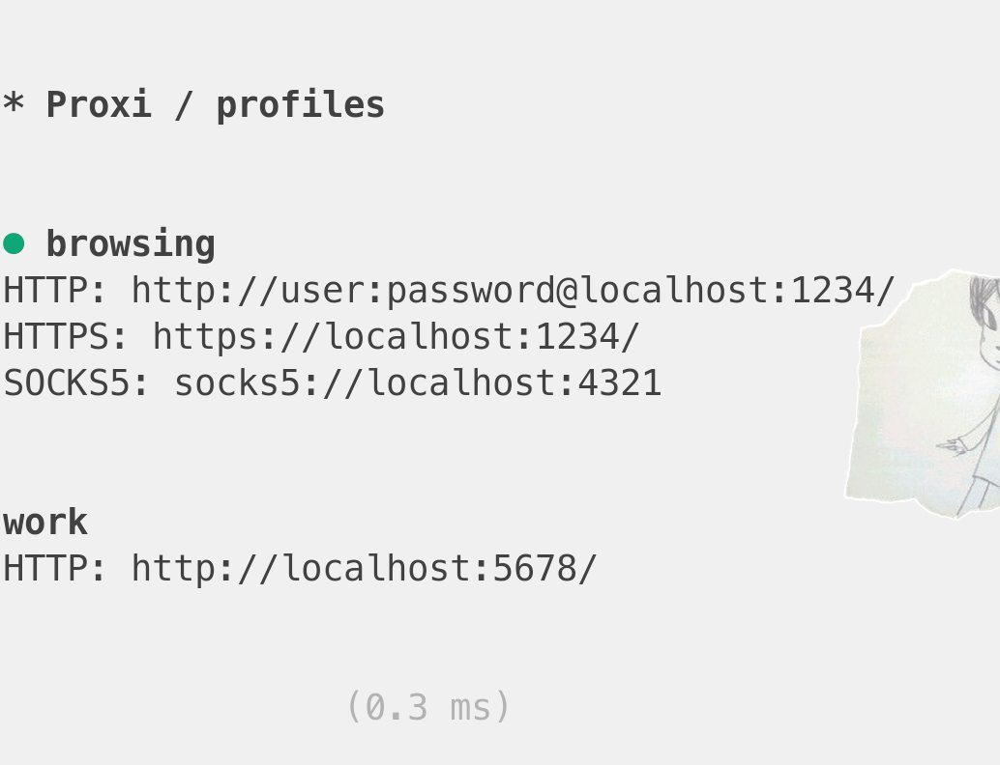
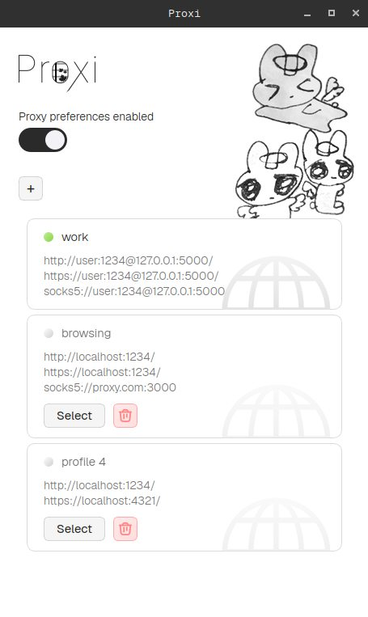

# Proxí

Little utility for managing proxy preferences in Linux. It does not forcefully tunnel all your requests, but
rather tells the apps to use specified proxy. This allows a more flexible control over which apps should
use a proxy and which apps should not

Quick command line example:

```sh
# Using a proxy set by Proxi
curl ifconfig.me

# Disabling a proxy for a specific app
HTTPS_PROXY="" wget https://example.com
```

Comes with **CLI** and **GUI** version

<table>
  <tr>
    <td valign="top">
     
    </td>
    <td width="500">
      
    </td>
  </tr>
</table>

## OS Compatibility

The app was tested with following Linux systems:

- GNOME-based distros (or systems with [gsettings](https://wiki.gentoo.org/wiki/Gsettings) support, which
  is enough)
  - Examples: Cinnamon, Ubuntu

- Distros with KDE 6
  - Examples: Manjaro KDE, Kubuntu

Other Linux systems may also work, but can require additional setup

## Installation

Install an [archive with an executable](https://github.com/one-with-violets-in-her-lap/proxi/releases/latest), choose UI or CLI version
and extract:

```shell
tar -xf ./proxi-cli.tar.gz # CLI version
tar -xf ./proxi-ui.tar.gz # UI version
```

You can run it like that:

```shell
# UI
./proxi-ui/proxi-ui

# CLI
./proxi-cli/proxi
```

To make it more convenient, add the binary to your shell PATH:

`~/.bashrc` (example):

```shell
PATH=$PATH:/path/to/proxi
```

### Integration with shell and unsupported systems

By default, the app only updates the settings of your desktop environment. But it also generates a setup script (`~/proxi_setup.sh`)
that you can use if you want to set a proxy for command line programs in your shell. To make this script
always run on shell startup, include it in your profile (e.g. `~/.bash_profile` or `~/.zshenv`):

```sh
if [[ -e ~/proxi_setup.sh ]]; then
    . ~/proxi_setup.sh
fi
```

> :eyes: You can also use this script to integrate Proxi on unsupported WM or DE by running it on startup (e.g. ~/.xsessionrc)

